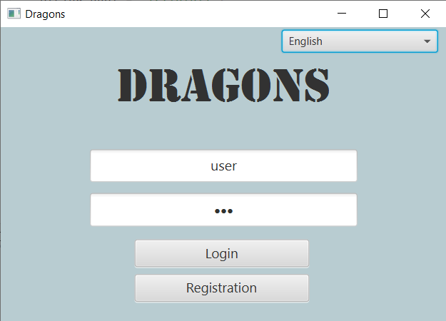
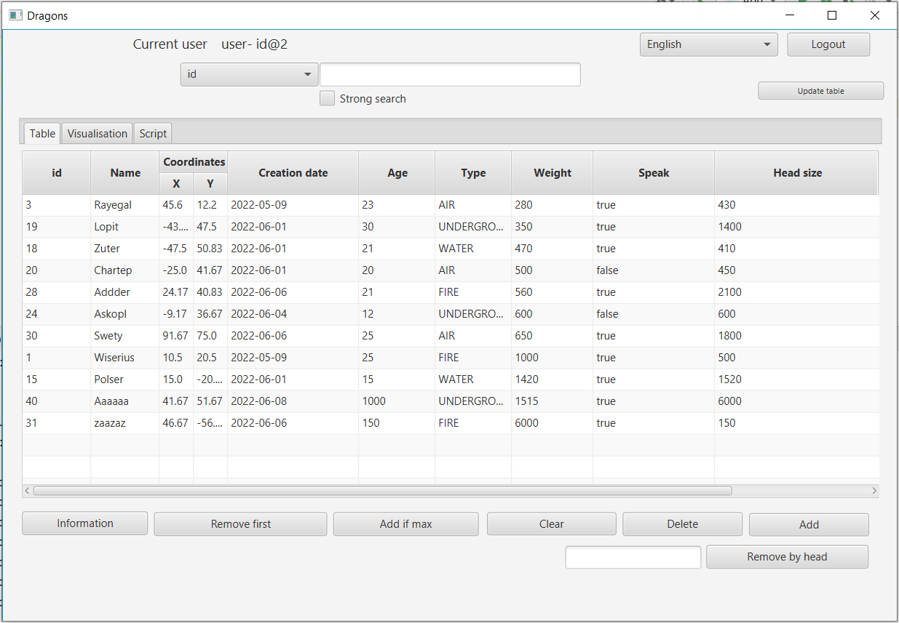
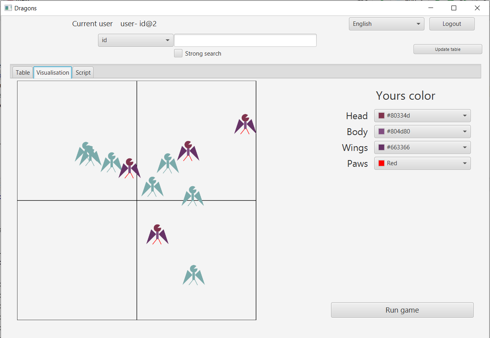
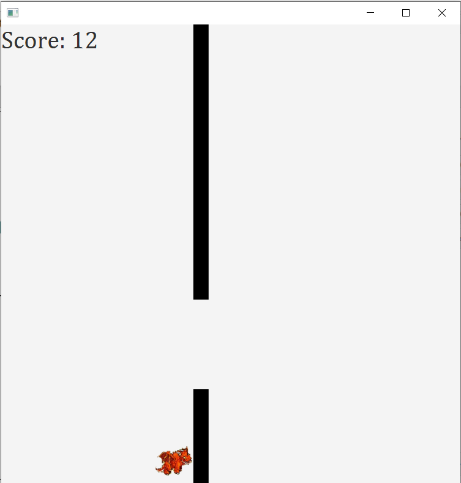
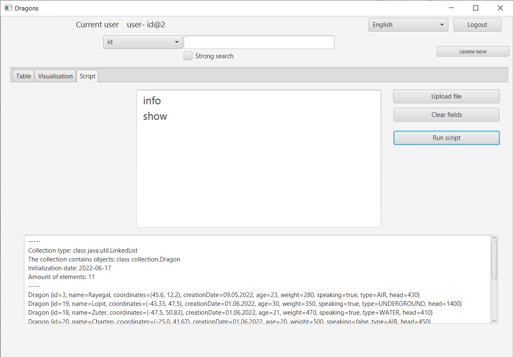
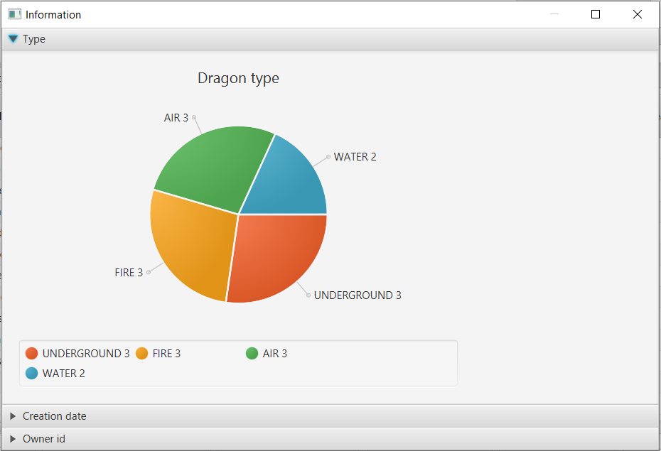
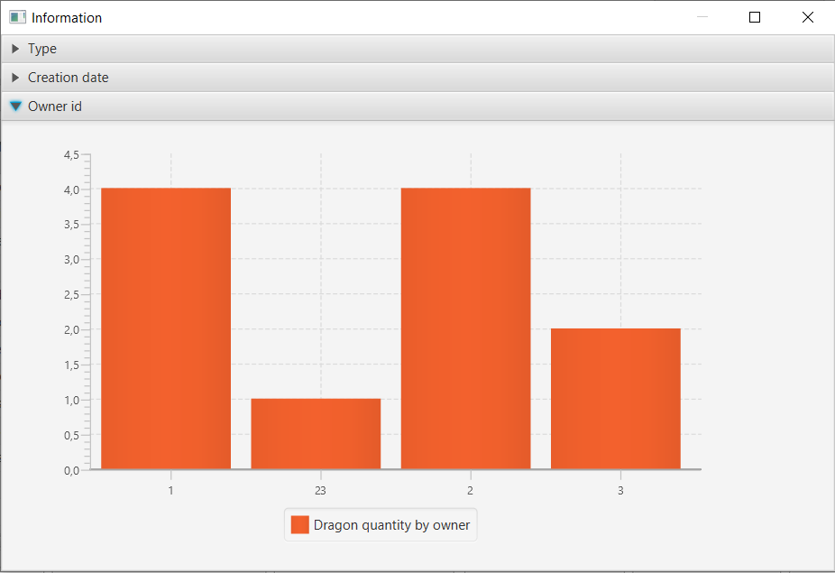
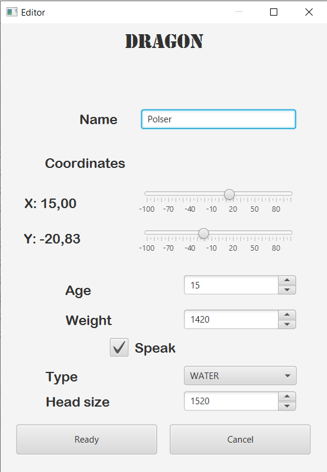

#Programming project for second semester

4 laboratory work for second semester at ITMO as one project

### Window for login/registration:

### Main window with table of dragons

### Main window with axis and visualisation via graphic primitives

### Game with sound and animation

### Script

### Information about collection

### Editor window

